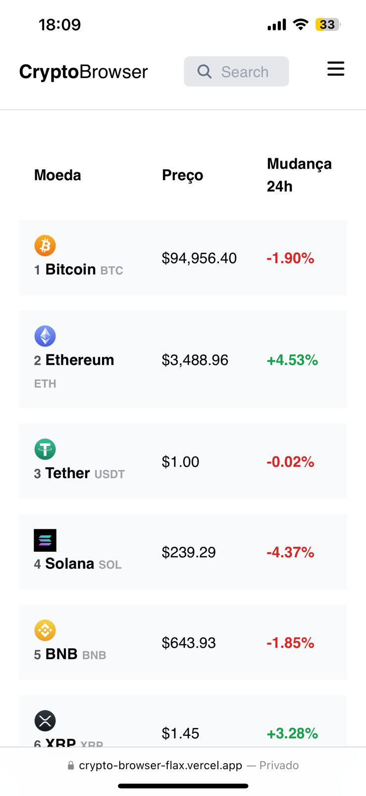

# Crypto Browser



## Sobre o Projeto

**Crypto Browser** é um projeto de estudo que lista as principais criptomoedas do mercado. O objetivo é permitir que o usuário visualize informações detalhadas sobre cada moeda, salve suas favoritas em uma watchlist, pesquise por nome e alterne entre os modos claro e escuro.

## Funcionalidades

- Listagem das principais criptomoedas.
- Visualização de detalhes individuais de cada moeda.
- Adição de moedas à watchlist (lista de favoritos).
- Pesquisa por nome de criptomoeda.
- Alteração entre os modos claro e escuro.

## Tecnologias Utilizadas

- **React**  
- **TypeScript**  
- **Tailwind CSS**  
- **Axios**  
- **React-Toastify**  
- **CoinCap.io API**  

## Como Executar o Projeto

1. Clone o repositório:  
   ```bash
   git clone git@github.com:henriquedevop/cryptoBrowser.git
   ```
2. Navegue até o diretório do projeto::  
   ```bash
   cd cryptoBrowser
   ```
3. Instale as dependências:  
   ```bash
   npm install
   ```
4. Inicie o servidor de desenvolvimento:  
   ```bash
   npm run dev
   ```
## Autor
Desenvolvido por [Henrique Devop](https://github.com/henriquedevop)